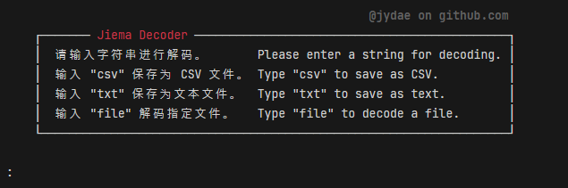

## Jiema Decoder

A multi-encoding decoder written in Python designed for efficient reporting in CSV format.<br>
Supports binary, morse, hexadecimal, base64, base32, URL encoding, and unicode escape.

<h3 align="center"></h3>

### Usage
---

1. **Run the script**
```bash
python3 jiema_decoder.py
```
To run the script, navigate to the directory where the script is located and execute the command.


2. **Input string**
```bash
:
```
When prompted, enter the string you want to decode. The script will identify the encoding format and display the decoded result.

```bash
:T2gsIG1vb2R5IGJsdWUuCg==

[02:48:30] [BASE64] [T2gsIG1vb2R5IGJsdWUuCg==] Decoded: Oh, moody blue.
```

3. **Special Commands**
   - Type `csv` to save the results as a CSV file.
   - Type `txt` to save the results as a text file.
   - Type `file` to decode strings from a specified file.
<br>
<br>

4. **File decoding**

If you choose to decode from a file, you will be prompted to enter the name or path of the file (i.e., `encodings.txt`).
The script will read each line from the file and attempt to decode them respectively.

### Requirements

```
pip install colorama
```
